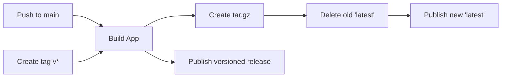

# Build Artifacts Guide

## Quick Links

- **Latest Build:** https://github.com/nprimmer/racker-stacker/releases/tag/latest
- **Direct Download:** https://github.com/nprimmer/racker-stacker/releases/download/latest/racker-stacker-latest.tar.gz

## How It Works

Every push to the `main` branch automatically:

1. **Builds** the application into optimized static files
2. **Packages** everything into tar.gz archives
3. **Publishes** to GitHub Releases under the `latest` tag
4. **Overwrites** the previous `latest` release

## Manual Build

To build artifacts locally:

```bash
# Simple command that does everything
npm run build:artifact

# Files will be in artifacts/ directory
ls -la artifacts/
```

## Artifact Contents

Each tar.gz contains:
- `index.html` - Application entry point
- `assets/` - Minified JS/CSS bundles
- `build-info.json` - Build metadata

## Deployment

Extract and serve with any web server:

```bash
# Download latest
wget https://github.com/nprimmer/racker-stacker/releases/download/latest/racker-stacker-latest.tar.gz

# Extract
tar -xzf racker-stacker-latest.tar.gz

# Serve (example with Python)
python3 -m http.server 8080
```

## Version History

- **Latest Release**: Always reflects the newest main branch commit
- **Version Tags** (v1.0.0, etc.): Stable releases preserved permanently

## CI/CD Pipeline



## Notes

- The `latest` release is marked as a pre-release to distinguish it from stable versions
- Each artifact includes a timestamp in the filename for tracking
- GitHub Actions artifacts are also stored for 30 days as backup